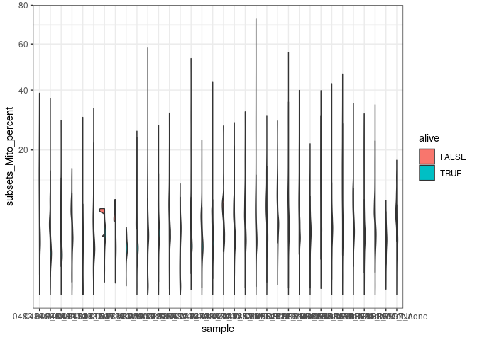
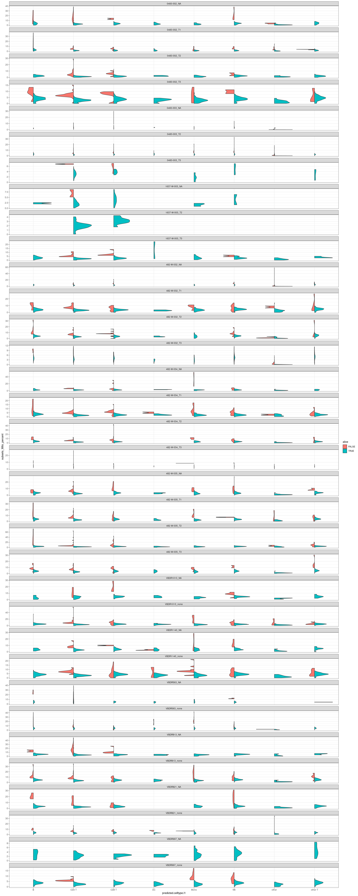
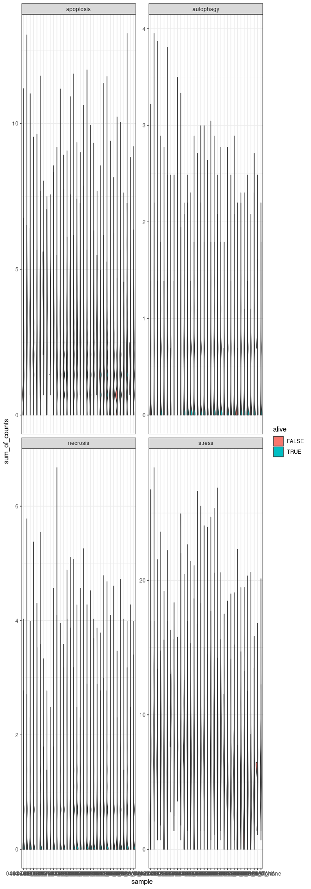
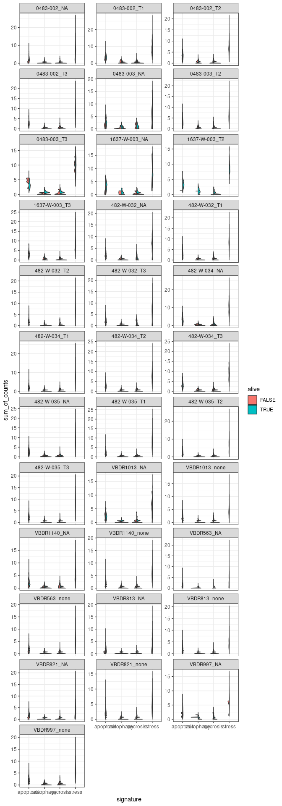
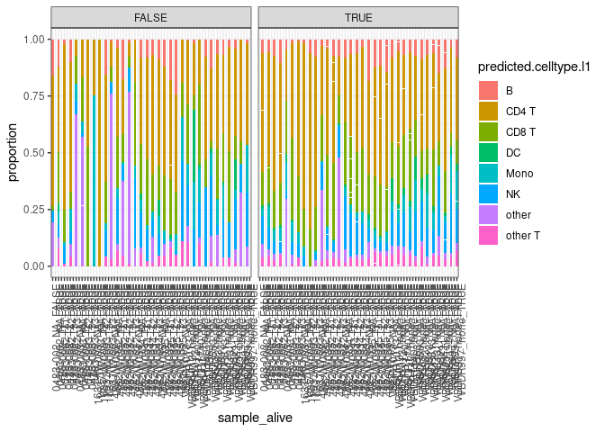
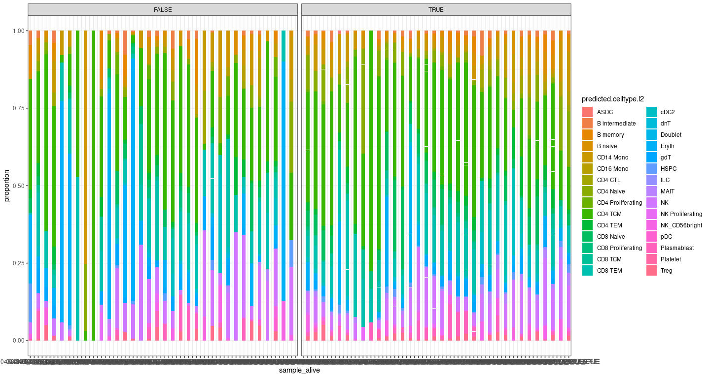
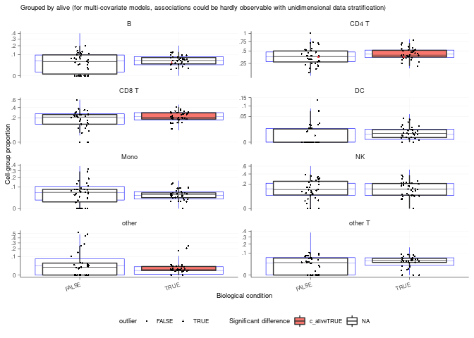
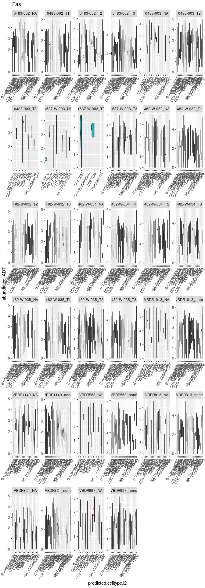
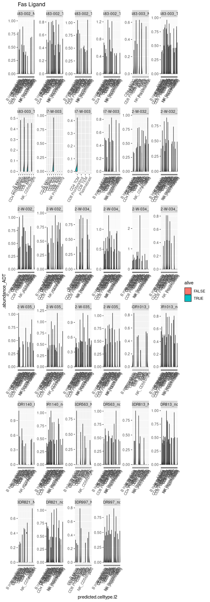
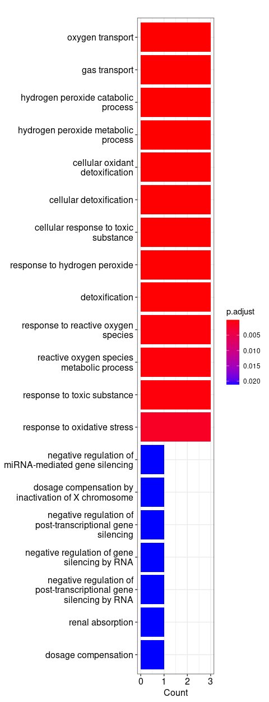

    library(Seurat)
    library(dplyr)
    library(SingleCellExperiment)
    library(cowplot)
    library(sccomp)
    library(ggplot2)
    library(patchwork)
    library(introdataviz)
    library(clusterProfiler)
    library(AnnotationDbi)
    library(org.Hs.eg.db)
    library(dittoSeq)
    library(tidyseurat)
    library(tidyr)
    library(tidyverse)
    library(tidySingleCellExperiment)
    library(tidysc)

## Loading all samples & define alive/dead

    #select directory
    files <- dir("/stornext/Bioinf/data/bioinf-data/Papenfuss_lab/projects/roestie/roestielisa/PBMC/data/3_prime_batch_1/preprocessing_results/non_batch_variation_removal/", full.name = T)
    #combine count dataframe by rows using seurat function merge
    merged_combined <- 
      files |>
      map(readRDS) |>
      purrr::reduce(merge)

    merged_combined #98,626 × 16

    ## # A Seurat-tibble abstraction: 81,601 × 21
    ## # Features=36601 | Cells=81601 | Active assay=SCT | Assays=HTO, ADT, RNA, SCT
    ##    .cell      orig.…¹ barcode sample Total LogProb  PValue Limited   FDR empty…²
    ##    <chr>      <chr>   <chr>   <chr>  <int>   <dbl>   <dbl> <lgl>   <dbl> <lgl>  
    ##  1 1_AAACGAA… 1       AAACGA… 0483-…  2713  -7269. 1.00e-4 TRUE        0 FALSE  
    ##  2 1_AACCTTT… 1       AACCTT… 0483-…  2308  -6688. 1.00e-4 TRUE        0 FALSE  
    ##  3 1_AATGACC… 1       AATGAC… 0483-…  4030  -9618. 1.00e-4 TRUE        0 FALSE  
    ##  4 1_AATGCCA… 1       AATGCC… 0483-…  6121 -12152. 1.00e-4 TRUE        0 FALSE  
    ##  5 1_AATGCCA… 1       AATGCC… 0483-…  3071  -7835. 1.00e-4 TRUE        0 FALSE  
    ##  6 1_ACATTTC… 1       ACATTT… 0483-…  4442 -10403. 1.00e-4 TRUE        0 FALSE  
    ##  7 1_ACCTACC… 1       ACCTAC… 0483-…  2523  -6755. 1.00e-4 TRUE        0 FALSE  
    ##  8 1_ACCTGTC… 1       ACCTGT… 0483-…  2860  -7497. 1.00e-4 TRUE        0 FALSE  
    ##  9 1_ACCTGTC… 1       ACCTGT… 0483-… 12112 -18492. 1.00e-4 TRUE        0 FALSE  
    ## 10 1_ACGGAAG… 1       ACGGAA… 0483-…  4857 -10737. 1.00e-4 TRUE        0 FALSE  
    ## # … with 81,591 more rows, 11 more variables: rank <dbl>, total <int>,
    ## #   fitted <dbl>, knee <dbl>, inflection <dbl>, nCount_ADT <dbl>,
    ## #   nFeature_ADT <int>, nCount_RNA <dbl>, nFeature_RNA <int>, nCount_SCT <dbl>,
    ## #   nFeature_SCT <int>, and abbreviated variable names ¹​orig.ident,
    ## #   ²​empty_droplet
    ## # ℹ Use `print(n = ...)` to see more rows, and `colnames()` to see all variable names

    #loading, merging and left_join
    files_annotation <- dir("/stornext/Bioinf/data/bioinf-data/Papenfuss_lab/projects/roestie/roestielisa/PBMC/data/3_prime_batch_1/preprocessing_results/annotation_label_transfer/", full.name = T)
    files_alive_identification <- dir("/stornext/Bioinf/data/bioinf-data/Papenfuss_lab/projects/roestie/roestielisa/PBMC/data/3_prime_batch_1/preprocessing_results/alive_identification", full.name = T)

    #load merge and join:
    merged_combined_annotation_alive <- #after annotation 98,626 × 20, after alive: 98,626 × 29
      
      #join annotation
      merged_combined |>
      left_join(
        files_annotation |>
          map(readRDS) |>
          purrr::reduce(bind_rows), by=".cell") |>
      #join alive identification
      left_join(
        files_alive_identification |>
          map(readRDS) |>
          purrr::reduce(bind_rows), by = c(".cell", "predicted.celltype.l1", "refUMAP_1", "refUMAP_2"))

    merged_combined_annotation_alive %>% select(sample) %>% table()

    ## tidyseurat says: Key columns are missing. A data frame is returned for independent data analysis.

    ## sample
    ##   0483-002_NA   0483-002_T1   0483-002_T2   0483-002_T3   0483-003_NA 
    ##          1324          3411          1261          4083           170 
    ##   0483-003_T2   0483-003_T3 1637-W-003_NA 1637-W-003_T2 1637-W-003_T3 
    ##          9306           109            67            54          1277 
    ##  482-W-032_NA  482-W-032_T1  482-W-032_T2  482-W-032_T3  482-W-034_NA 
    ##          1119          3924          4193          2200           841 
    ##  482-W-034_T1  482-W-034_T2  482-W-034_T3  482-W-035_NA  482-W-035_T1 
    ##          6413          3527          1385          1158          4101 
    ##  482-W-035_T2  482-W-035_T3   VBDR1013_NA VBDR1013_none   VBDR1140_NA 
    ##          5366          4550           150          3825           516 
    ## VBDR1140_none    VBDR563_NA  VBDR563_none    VBDR813_NA  VBDR813_none 
    ##          4655           148          1689           407          4496 
    ##    VBDR821_NA  VBDR821_none    VBDR997_NA  VBDR997_none 
    ##           410          3496           138          1832

    ## alive
    ## FALSE  TRUE 
    ##  2087 79514

### Identity ?

## Plot 1 - Visualisation of Mitochondria content

### For each sample

    #original ggplot
    merged_combined_annotation_alive |>
      
      #violin plot
      ggplot(aes(x=sample, y=subsets_Mito_percent, fill=alive)) + 
      introdataviz::geom_split_violin() +
      scale_y_sqrt() +
      theme(axis.text.x=element_text(angle=70, hjust=1)) +
      theme_bw()

    ## Warning: Groups with fewer than two data points have been dropped.

### For each sample according to cell type

    #facet by sample, x= celltypes
    merged_combined_annotation_alive |>
      
      #violin plot
      ggplot(aes(x=predicted.celltype.l1, y=subsets_Mito_percent, fill=alive)) + 
      introdataviz::geom_split_violin() +
      facet_wrap(~sample, scale="free_y", ncol =1) +
      theme(axis.text.x=element_text(angle=70, hjust=1)) +
      theme_bw()

    ## Warning: Groups with fewer than two data points have been dropped.
    ## Groups with fewer than two data points have been dropped.
    ## Groups with fewer than two data points have been dropped.
    ## Groups with fewer than two data points have been dropped.
    ## Groups with fewer than two data points have been dropped.
    ## Groups with fewer than two data points have been dropped.
    ## Groups with fewer than two data points have been dropped.
    ## Groups with fewer than two data points have been dropped.
    ## Groups with fewer than two data points have been dropped.
    ## Groups with fewer than two data points have been dropped.
    ## Groups with fewer than two data points have been dropped.
    ## Groups with fewer than two data points have been dropped.
    ## Groups with fewer than two data points have been dropped.
    ## Groups with fewer than two data points have been dropped.
    ## Groups with fewer than two data points have been dropped.
    ## Groups with fewer than two data points have been dropped.
    ## Groups with fewer than two data points have been dropped.
    ## Groups with fewer than two data points have been dropped.
    ## Groups with fewer than two data points have been dropped.
    ## Groups with fewer than two data points have been dropped.
    ## Groups with fewer than two data points have been dropped.
    ## Groups with fewer than two data points have been dropped.
    ## Groups with fewer than two data points have been dropped.
    ## Groups with fewer than two data points have been dropped.
    ## Groups with fewer than two data points have been dropped.
    ## Groups with fewer than two data points have been dropped.
    ## Groups with fewer than two data points have been dropped.
    ## Groups with fewer than two data points have been dropped.
    ## Groups with fewer than two data points have been dropped.
    ## Groups with fewer than two data points have been dropped.
    ## Groups with fewer than two data points have been dropped.
    ## Groups with fewer than two data points have been dropped.
    ## Groups with fewer than two data points have been dropped.
    ## Groups with fewer than two data points have been dropped.
    ## Groups with fewer than two data points have been dropped.
    ## Groups with fewer than two data points have been dropped.
    ## Groups with fewer than two data points have been dropped.
    ## Groups with fewer than two data points have been dropped.
    ## Groups with fewer than two data points have been dropped.
    ## Groups with fewer than two data points have been dropped.
    ## Groups with fewer than two data points have been dropped.
    ## Groups with fewer than two data points have been dropped.
    ## Groups with fewer than two data points have been dropped.
    ## Groups with fewer than two data points have been dropped.
    ## Groups with fewer than two data points have been dropped.
    ## Groups with fewer than two data points have been dropped.
    ## Groups with fewer than two data points have been dropped.
    ## Groups with fewer than two data points have been dropped.
    ## Groups with fewer than two data points have been dropped.

## Plot 2 - Visualisation of apoptosis, necrosis, autophagy and stress markers

    # selecting stress markers - splitting the markers for better visualisation
    stress_markers <- c("JUN", "FOS", "IL6", "TNF", "CXCR4", "SNAI1", "VIM", "GADD45B", "MCL1","STAT1", "IRF7", "IRF3", "IRF1", "CDKN2A", "TP53", "MRTFB", "RBL1", "NUPR1", "IFNG", "IFNB1", "IFNA2", "IFNL1", "IFNA1", "IFNK", "TNF", "IL-12")

    #selecting death markers
    apoptosis_markers <- c("BCL2L1", "CASP9", "CHP2", "CYCS", "EXOG", "IL1A", "IL1R1", "IL1RAP", "IL3RA", "PIK3CA", "PIK3CD", "PIK3CG", "PIK3R1", "PIK3R2", "PRKAR1B", "NFKBIA", "TNFRSF10A", "TNFRSF10B", "TNFRSF10D", "TNFRSF1A")
    necrosis_markers = c("DNML1", "GSDME", "IPMK", "MLKL", "RBCK1", "TICAM1", "YBX3")
    autophagy_markers = c("ATG12", "GABARAPL1", "IFNA17", "IFNA8")

    #first drop the MT gene from the nCount_SCT :
    mitochondrial_genes = grep("^MT-", rownames(merged_combined_annotation_alive[["SCT"]]),value = T)
    ribosomal_genes = grep("^RP(S|L)", rownames(merged_combined_annotation_alive[["SCT"]]), value = T)

    #remove the gene from the matrix #dim before 98,626 × 29.     98,626 × 29
    merged_combined_annotation_alive_no_MT_no_rib <-
      merged_combined_annotation_alive[! rownames(merged_combined_annotation_alive) %in% mitochondrial_genes, ]

    merged_combined_annotation_alive_no_MT_no_rib <-
      merged_combined_annotation_alive_no_MT_no_rib[! rownames(merged_combined_annotation_alive_no_MT_no_rib) %in% ribosomal_genes, ]

    #re-scaling, see github
    all.genes <- rownames(merged_combined_annotation_alive_no_MT_no_rib)
    head(all.genes)

    ## [1] "MIR1302-2HG" "FAM138A"     "OR4F5"       "AL627309.1"  "AL627309.3" 
    ## [6] "AL627309.2"

    merged_combined_annotation_alive_no_MT_no_rib<- ScaleData(merged_combined_annotation_alive_no_MT_no_rib, assay = "SCT", slot='scale.data', features = all.genes)

    ## Warning: The following arguments are not used: slot

    ## Centering and scaling data matrix

    # Creating gene signatures:

    # 1 create a gene signature + genes in the signature dataframe:
    #stress
    stress_markers_df <- as.data.frame(stress_markers)
    stress_markers_df$signature <- "stress"
    colnames(stress_markers_df)[1] <- ".feature"

    apoptosis_markers_df <- as.data.frame(apoptosis_markers)
    apoptosis_markers_df$signature <- "apoptosis"
    colnames(apoptosis_markers_df)[1] <- ".feature"

    necrosis_markers_df <- as.data.frame(necrosis_markers)
    necrosis_markers_df$signature <- "necrosis"
    colnames(necrosis_markers_df)[1] <- ".feature"

    autophagy_markers_df <- as.data.frame(autophagy_markers)
    autophagy_markers_df$signature <- "autophagy"
    colnames(autophagy_markers_df)[1] <- ".feature"

    #bind by rows, obtain only 1 dataframe with all the signatures
    gene_signatures <- rbind(stress_markers_df, apoptosis_markers_df, necrosis_markers_df, autophagy_markers_df)

    #combine the new dataframe with my seurat object:
    #join seurat object with signature dataframe, option long, bind by col created = .features
    merged_combined_annotation_alive_no_MT_no_rib_signature <-
    merged_combined_annotation_alive_no_MT_no_rib |>
      join_features(
        features = c(stress_markers, apoptosis_markers, necrosis_markers, autophagy_markers),
        shape="long") |>
      left_join(gene_signatures, by = ".feature")

    ## tidyseurat says: This operation lead to duplicated cell names. A data frame is returned for independent data analysis.

    #Plot 1 - facet by gene signatures
    merged_combined_annotation_alive_no_MT_no_rib_signature |>
      group_by(.cell, signature, alive, sample) |>
      mutate(sum_of_counts = sum(.abundance_SCT)) |>
    #create the ggplot facet by gene signatures
      ggplot(aes(x=sample, y=sum_of_counts, fill=alive)) + 
      introdataviz::geom_split_violin() +
      facet_wrap(~signature,  scale="free_y" ) + #ncol=1
      theme(axis.text.x=element_text(angle=70, hjust=1)) +
      theme_bw()

    #Plot 2 - facet by samples
    #create the column sum of counts
    merged_combined_annotation_alive_no_MT_no_rib_signature |>
      group_by(.cell, signature, alive, sample) |>
      mutate(sum_of_counts = sum(.abundance_SCT)) |>

    #create the ggplot facet by samples
      ggplot(aes(x=signature, y=sum_of_counts, fill=alive)) + 
      introdataviz::geom_split_violin() +
      facet_wrap(~sample, scale="free_y", ncol=3) + #ncol=1
      theme(axis.text.x=element_text(angle=70, hjust=1)) +
      theme_bw()

## Plot 3 - Composition of cells

    ## # A tibble: 280 × 9
    ##    predicted.ce…¹ param…² covar…³ c_lower c_eff…⁴ c_upper  c_pH0  c_FDR count_…⁵
    ##    <chr>          <chr>   <chr>     <dbl>   <dbl>   <dbl>  <dbl>  <dbl> <list>  
    ##  1 B              (Inter… <NA>    -9.85   -1.50     7.29  0.392  0.129  <tibble>
    ##  2 B              aliveT… alive   -0.0272  0.162    0.363 0.649  0.242  <tibble>
    ##  3 B              sample… sample  -0.656  -0.0340   0.501 0.721  0.413  <tibble>
    ##  4 B              sample… sample  -0.319   0.433    1.09  0.263  0.146  <tibble>
    ##  5 B              sample… sample  -0.0379  0.554    1.10  0.117  0.0526 <tibble>
    ##  6 B              sample… sample  -3.65   -1.26     0.379 0.106  0.0352 <tibble>
    ##  7 B              sample… sample  -4.02   -1.90    -0.954 0      0      <tibble>
    ##  8 B              sample… sample  -3.60   -0.591    1.65  0.371  0.128  <tibble>
    ##  9 B              sample… sample  -1.29    1.21     3.69  0.194  0.0774 <tibble>
    ## 10 B              sample… sample  -0.680   2.91     6.83  0.0683 0.0228 <tibble>
    ## # … with 270 more rows, and abbreviated variable names ¹​predicted.celltype.l1,
    ## #   ²​parameter, ³​covariate, ⁴​c_effect, ⁵​count_data
    ## # ℹ Use `print(n = ...)` to see more rows

    ## [[1]]

## Plot 4 - Check marker for activation induced cell death (Fas/CD95 - FasL/CD95L)

## Plot 5 - Gene Ontology genes analysis

    ## [1] "TRUE"  "FALSE"

### Gene Ontology: Alive cells

    ##                p_val avg_log2FC pct.1 pct.2     p_val_adj
    ## EEF1B2 2.762514e-130  0.5617551 0.977 0.849 1.007903e-125
    ## MAL     3.329398e-28  0.5145246 0.324 0.219  1.214731e-23
    ## CCL4    2.839381e-13  0.5995569 0.230 0.165  1.035948e-08
    ## FGFBP2  3.442098e-11  0.5205110 0.263 0.207  1.255849e-06
    ## GZMH    3.467994e-11  0.5085333 0.304 0.250  1.265298e-06

### Gene Ontology: Dead cells

    ##                   p_val avg_log2FC pct.1 pct.2     p_val_adj
    ## MTRNR2L12 8.786571e-114  1.3003869 0.602 0.432 3.205780e-109
    ## HBB        4.335197e-66  2.2066964 0.944 0.935  1.581697e-61
    ## HBA2       6.547408e-33  2.0963971 0.599 0.549  2.388822e-28
    ## NEAT1      4.070261e-29  1.1273070 0.690 0.656  1.485035e-24
    ## HBA1       7.437984e-22  2.0957702 0.406 0.351  2.713749e-17
    ## NKTR       3.151715e-11  0.5346292 0.487 0.451  1.149903e-06
    ## XIST       6.928592e-05  0.5857621 0.264 0.240  1.000000e+00

